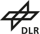
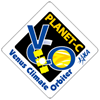
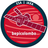
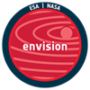

## MoUs

[DLR - Institute of Space Research](https://www.dlr.de/en/wr)

[KAIST - SaTRec](https://satrec.kaist.ac.kr/)

[BK21 FOUR Institute of Earth, Atmosphere, Astronomy at Yonsei University](http://bk21eaa.yonsei.ac.kr/en/)

[D'Annunzio University](http://www.unich.it) 

## Collaboration

[JAXA/Akatsuki/UVI](https://www.isas.jaxa.jp/en/missions/spacecraft/current/akatsuki.html)

[ESA-JAXA/BepiColombo](https://sci.esa.int/web/bepicolombo)

[Venus Science Coordination Group (VeSCoor)](https://www.cosmos.esa.int/web/envision/vescoor-page)

[ESA/EnVision/VenSpec-Suite](https://www.cosmos.esa.int/web/envision)

