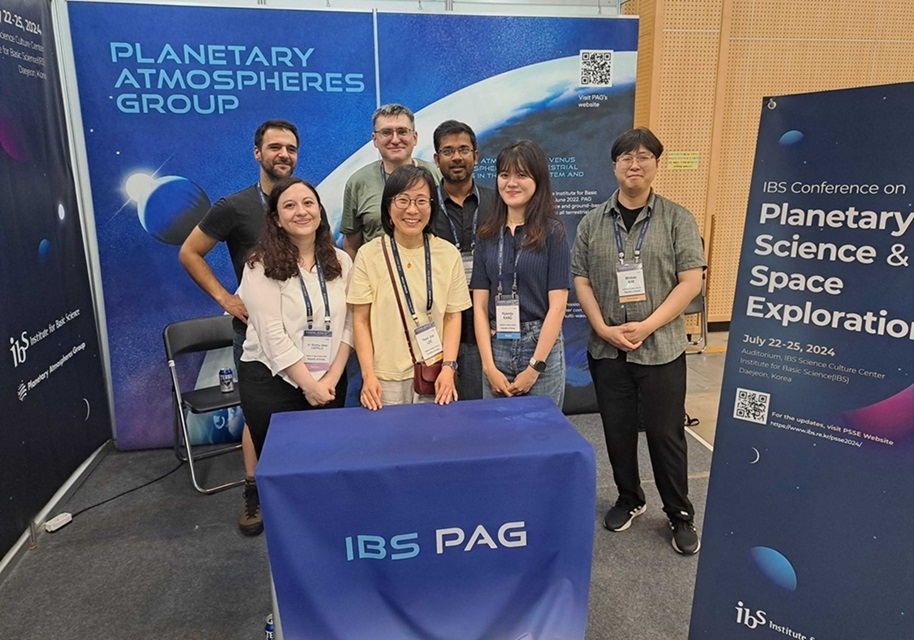

The Planetary Atmospheres Group (PAG) from the Institute for Basic Science (IBS) participated as a sponsor in the last Committee on Space Research (COSPAR) Assembly carried out in BEXCO, Busan, South Korea.

Three members of our group, Dr. Yeon Joo Lee, Dr. Evgenij Zubko, and Dr. Jose Silva, discussed their ongoing research during the scientific sessions that included Venus science, planetary atmospheres, and small bodies in the Solar System. Also, three members of our group, Dr. Ashimananda Modak, Hyeonju Kang, and Dr. Minbae Kim presented their recent research in the poster session.

