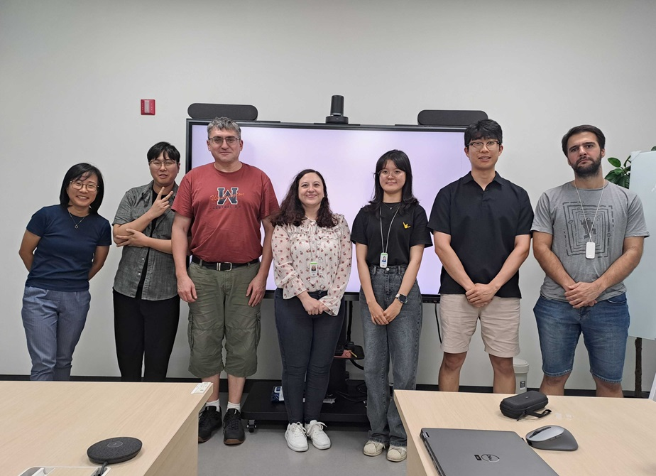

Intern Seongbong Han (Yonsei University) gave a seminar titled "Mie scattering code development". Additionally, intern Hyeon Ju Kang (Yonsei University) talked about her current progress in a seminar titled "Characterization of small-scale UV contrast at Venus' cloud top level". We congratulate our intern students who conducted successful research this summer.

