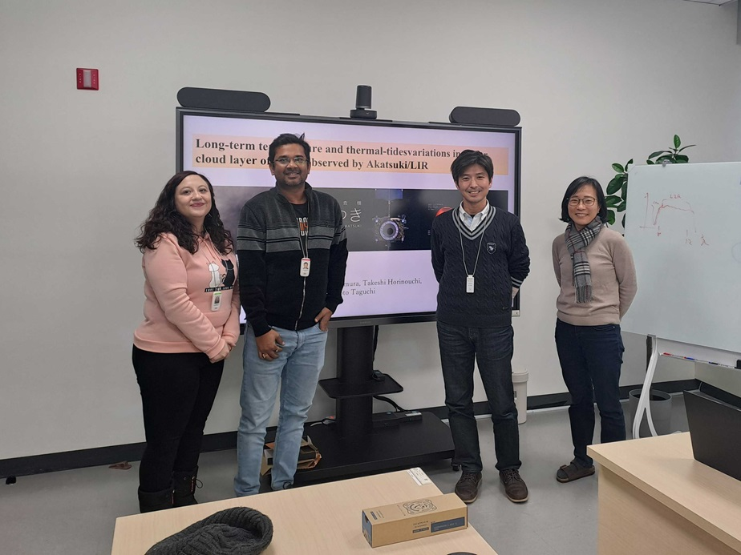

Dr. Toru Kouyama  (National Institute of Advanced Industrial Science and Technology, AIST, Japan) visited PAG and introduced his ongoing research. 

Dr. Kouyama gave a seminar on two different topics. First, Dr. Koutama discussed "Long-term temperature and thermal tides variation in the upper cloud layer of Venus, observed by Akatsuki/LIR". In addition, Dr. Kouyama introduced the second topic, "Introducing Optical Navigation Cameras onboard Hayabusa2, and its current status in Hayabusa 2's extended mission phase".

