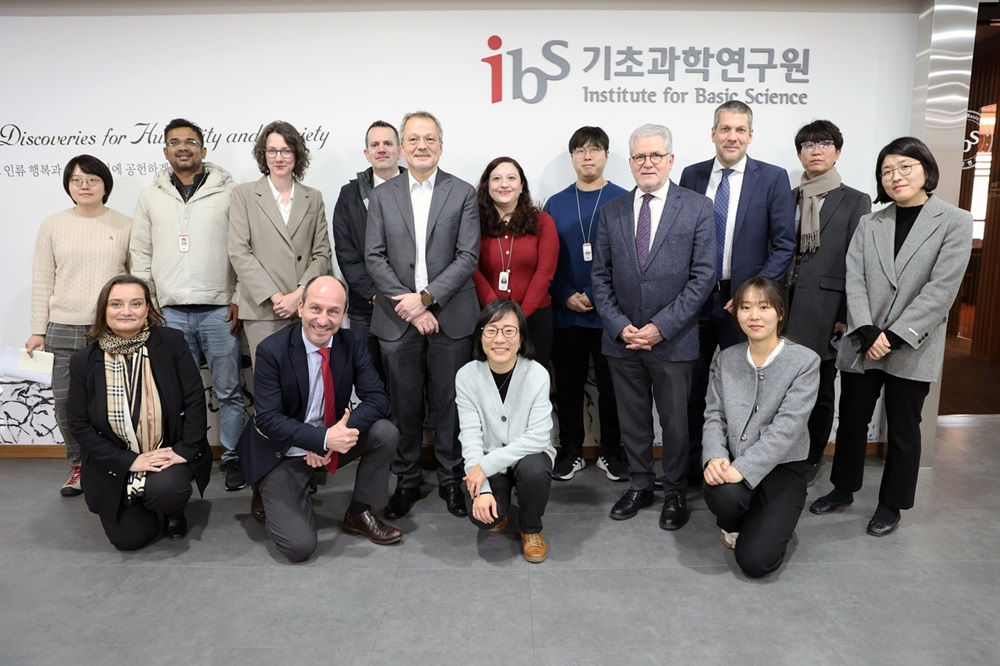

ESA delegation holds meeting with PAG members at IBS on 14th of January 2025. Research activities at planetary group atmospheres (PAG) were shared at the meeting. Discussions were also made regarding current bottom-up research collaboration between South Korea and ESA and future perspective.

