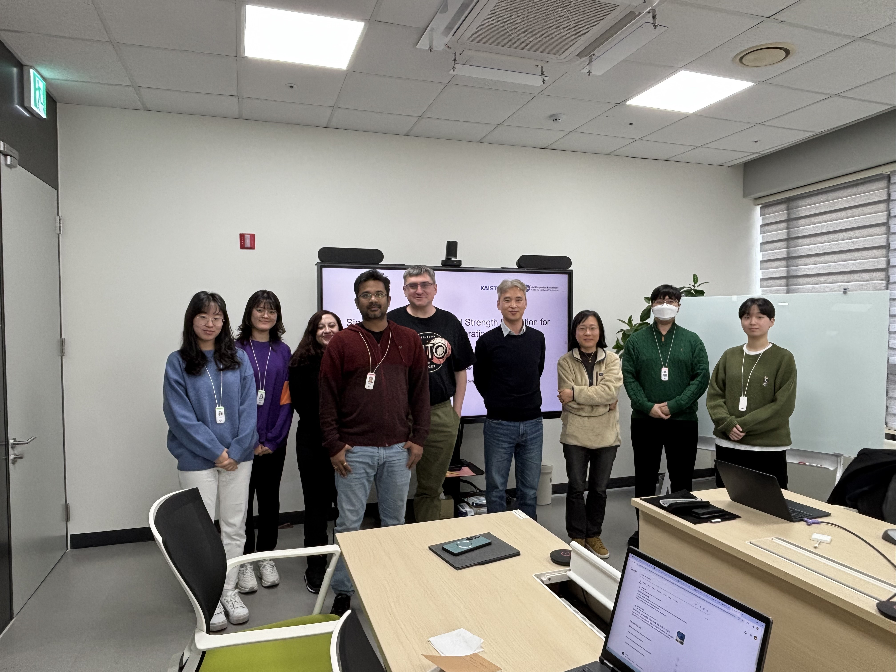

Professor Hyo-Sang Shin from the Autonomous and intelligent System Lab, KAIST visited PAG and presented his talk 
here at IBS regarding source seeking intelligence. In his talk, he presented abilities of various statistical-numerical methods for searching objects by robots. The objects were equivalent to a radio wave emitter.   
This project has been carried out in collaboration with NASA. The purpose of this project was to deploy
robot in an unknown challenging environment such as Mars.

Dr. Hyo-Sang Shin is a professor at Autonomous and intelligent System Lab, KAIST who visited PAG on 25th Feb. 2025.
Professor Hyo-Sang Shin, received an MSc on flight dynamics, guidance and control in Aerospace Engineering from KAIST and gained a PhD on cooperative missile guidance from Cranfield University. He is a Lecturer on Guidance, Control and Navigation Systems in Autonomous and Intelligent Systems Group at Cranfield University since 2010. He participated in the 3rd Korea Robot Aircraft Competition with Team Highest winning the Silver (2004) and Most Popular Team award (2004). 

